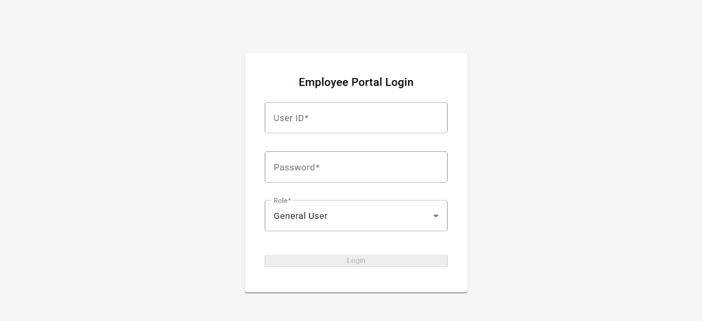
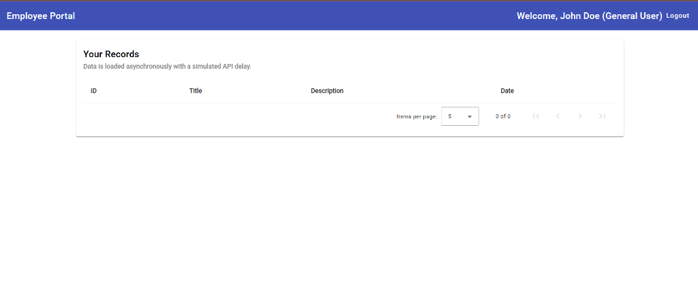
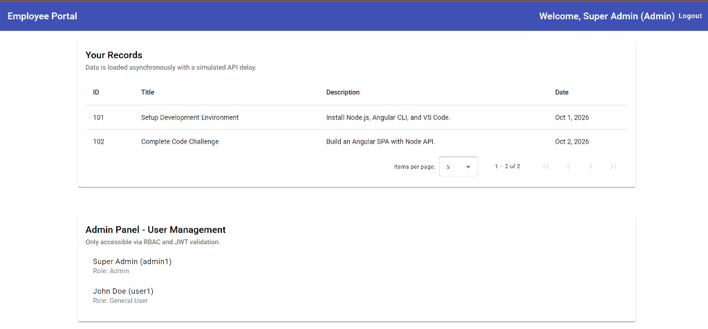

# Employee Portal Dashboard

This project is a complete, production-grade single-page application (SPA) built to demonstrate clean architecture, advanced security patterns, role-based access control (RBAC), and asynchronous API handling.

## Architecture & Tech Stack

- **Frontend:** Angular 17 (TypeScript) with Angular Material for a modern, clean UI.
- **Backend:** Node.js, Express, TypeScript.
- **Database Architecture:** Built using the **Repository Design Pattern** with a Local JSON DB. 
  - *Note for Reviewers:* The repository layer (`json.repository.ts`) allows the business logic to remain completely agnostic of the database. This means it can be seamlessly swapped for AWS DynamoDB or MongoDB in a production environment with zero changes to the controllers.
- **DevOps:** Fully containerized using Docker and Docker Compose (includes Nginx for the frontend, Node for the backend, and Redis).

## Enterprise-Grade Features Implemented

### Security & Authentication
- **JWT (JSON Web Tokens):** Secure, stateless authentication. The backend generates signed JWTs upon login.
- **Role-Based Access Control (RBAC):** Backend middleware (`requireAdmin`) validates JWT claims to restrict sensitive endpoints.
- **HTTP Interceptors:** An Angular interceptor automatically attaches the `Authorization: Bearer <token>` header to all outgoing requests and handles `401 Unauthorized` redirects globally.
- **Rate Limiting:** Protects the API against brute-force and DDoS attacks using `express-rate-limit`.
- **Security Headers:** Implemented `helmet` middleware to secure Express apps by setting various HTTP headers.

### Observability & Resilience
- **Correlation IDs:** A middleware generates and attaches a unique UUID (`x-correlation-id`) to every request and response, enabling distributed tracing across microservices.
- **Global Error Handling:** A centralized Express error handler securely logs exceptions (using Correlation IDs) without leaking stack traces to the client.
- **Audit Logging:** Admin actions on sensitive routes trigger an audit middleware that securely logs the timestamp, Admin ID, HTTP action, and Correlation ID.
- **Network Retry Mechanism:** The Angular HTTP Interceptor includes an RxJS `retry(2)` pipe to automatically retry transient network failures before bubbling up errors.

### UI/UX & Data Handling
- **Simulated Async Processing:** The backend includes a configurable delay mechanism (`?delay=ms`) to demonstrate how the frontend gracefully handles asynchronous loading states.
- **Skeleton & Spinner States:** Uses Angular Material Spinners to prevent UI blocking while data fetches.
- **Advanced Data Tables:** Implemented Angular Material Tables with native **Pagination** and **Sorting** for high-performance data rendering.

## Screenshots

### The Login Interface
Clean, responsive login card built with Angular Material.



### Role-Based Dashboards
The system natively handles role-based state management, protecting routes via JWT validation and Angular Guards.

**General User View:**


**Admin View (with User Management):**


## How to Run Locally

### Option A: Using Docker (Recommended)
You can spin up the entire stack (Frontend on Nginx, Backend API, and Redis) with a single command:
```bash
docker-compose up --build
```
- **Frontend:** `http://localhost:4200`
- **Backend API:** `http://localhost:3000`

### Option B: Manual Startup

**1. Start the Backend**
```bash
cd backend
npm install
npm run dev
```
The server will start on `http://localhost:3000`.

**2. Start the Frontend**
```bash
cd frontend
npm install
npm start
```
Navigate to `http://localhost:4200` to view the application.

### Test Credentials
- **Admin Access:** `admin1` / `password123`
- **General User Access:** `user1` / `password123`
